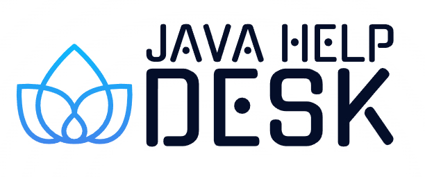

 

 

 
<h1>Digitl Alchemyst</h1>
<h2>Digital Alchemyst Studios</h2>
<h3>Full Stack Java Script Developer</h3>

- 📚 I am self taught learning through reading open source code & free online training

- 🔭 I’m currently working on a Full Stack business managment application with AI intergration 🔥😎

- 🌱 I’m currently learning ** Next.js, Appwrite, Firebase/Googel Cloud, MongoDB, Express, React, NodeJs**

<h3 align="left">Connect with me:</h3>

    
    
    
    
    
    

## <h3 align="left">Languages and Tools:</h3>

    
    
    
    
    
    
    
    
    

<h3 align="left">Support:</h3>

    

 
 
 

    
    
    

# 🌟 Welcome to my Github! 🚀

> 💻 Full-stack Developer | 🚀 Open Source Enthusiast | 🌱 Lifelong Learner

### 🚀 About Me

- 🔭 I'm currently working on [Your Current Project]
- 🌱 I'm currently learning [What You're Learning]
- 👯 I'm looking to collaborate on [Type of Projects]
- 🤔 I'm looking for help with [What You Need Help With]
- 💬 Ask me about [Your Expertise]
- ⚡ Fun fact: [Interesting Fact About You]

💙 If you like my projects, Give them ⭐ and Share it with friends!

---

## 🛠️ My Tech Stack

| Category  | Skills|
| --------------------------------- | -------------------------------------------- |
| **Languages**                     |      |
| **Frontend Frameworks/Libraries** |    |
| **Backend Frameworks**            |   |
| **State Management**              |    |
| **CSS Frameworks/Preprocessors**  |    |
| **Testing**                       |   |
| **Databases**                     |            |
| **Cloud Platforms**               |     |
| **DevOps Tools**                  |       |
| **IDEs/Tools**                    |   |
| **Build Tools**                   |    |
| **Mobile Development**            |   |
| **AI/ML**                         |       |

## 📊 My GitHub Stats

  
  

---

## 🏆 GitHub Trophies

---

## 📈 Contribution Graph

---

  

### 🌟 Top Projects

---

### 🔥 Streak Stats

---

### 📫 Let's Connect

---

⭐️ From [Digitl-Alchemyst](https://github.com/Digitl-Alchemyst)

  
  <h1>👋 Hi there, I'm [Your Name]</h1>

  
  
  

### 🛠 Tech Stack

&nbsp;
&nbsp;
&nbsp;
&nbsp;
\
&nbsp;
&nbsp;
&nbsp;
&nbsp;
&nbsp;

### ⚙️ &nbsp;GitHub Analytics

### 🏆 GitHub Profile Trophy:

  

### 🔝 Top Contributed Repo

  

---

## 🎵 Vibing to

